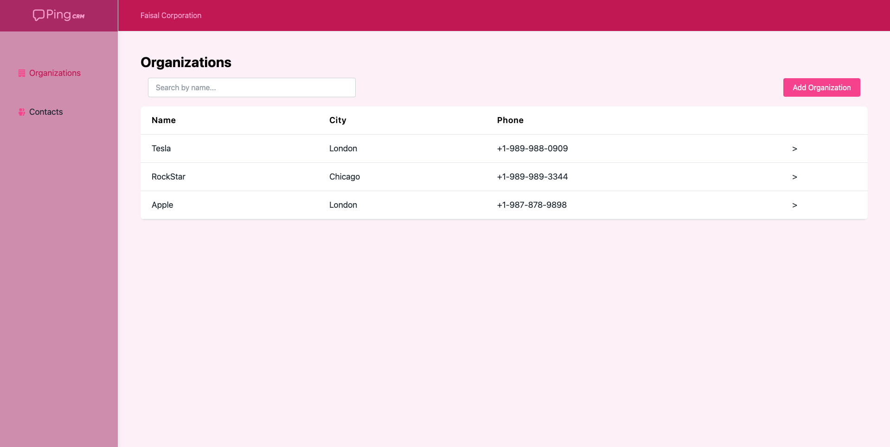
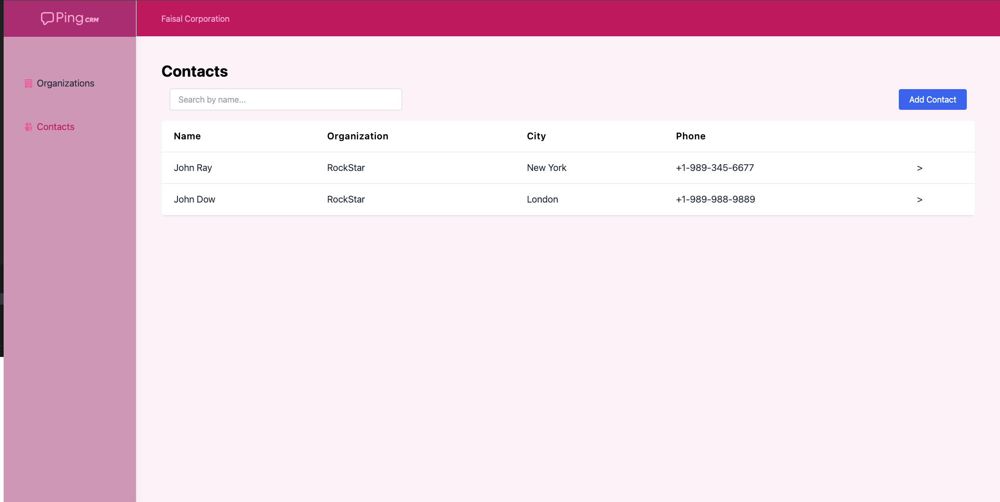
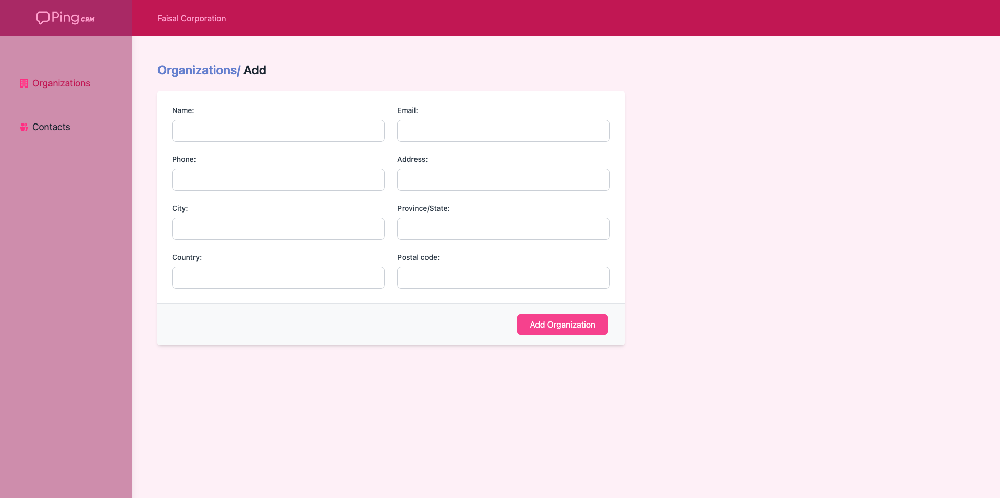
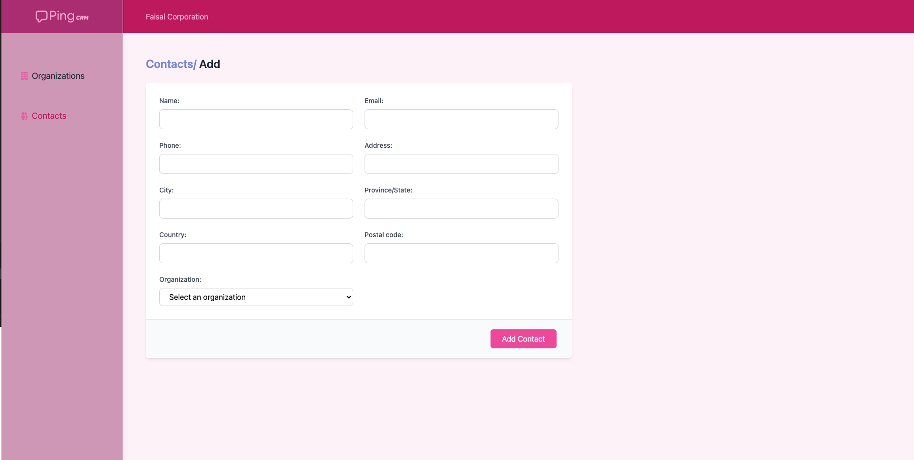
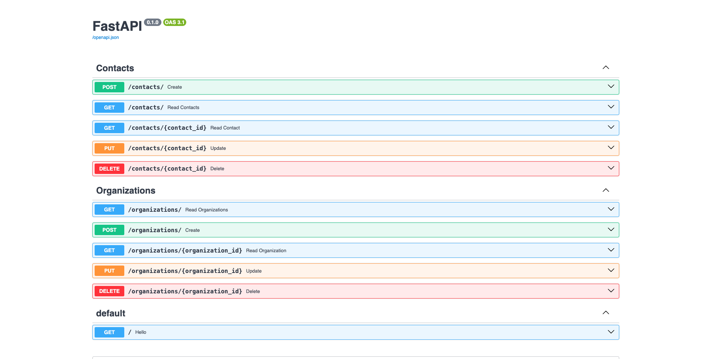

# 🧠 PingCRM - Full-Stack App with React & FastAPI

A modern take on the original PingCRM concept, built using **React** for the frontend and **FastAPI** on the backend. It’s a compact CRM system featuring **contact** and **company management**, integrated with a **PostgreSQL database via Supabase**.

---

## 🚀 Live Demo

- 🔗 **Frontend:** [Vercel Deployment](https://pingcrm-swart.vercel.app)
- 🔗 **Backend:** [Render Deployment](https://pingcrm-opw3.onrender.com)

---

## ⚙️ Local Setup Guide

### 🔧 Backend (FastAPI)

```bash
# Navigate to backend directory
cd backend

# Set up a virtual environment
# macOS/Linux:
python3 -m venv .venv
source .venv/bin/activate

# Windows:
python -m venv .venv
.venv\Scripts\activate

# Install required packages
pip install -r requirements.txt

# Configure environment
cp .env.example .env
# Set your Supabase DATABASE_URL inside .env

# Start development server
uvicorn app.main:app --reload
```

### 💻 Frontend (React)

```bash
cd frontend

# Setup environment config
cp .env.example .env
# Add your backend URL:
REACT_APP_SERVER=https://pingcrm-opw3.onrender.com

# Install dependencies and start server
npm install
npm start
```

---

## 🧱 Database Overview

This app uses **Supabase PostgreSQL** and connects via **SQLAlchemy**.

- Connection managed through `.env` as `DATABASE_URL`
- Tables:
  - `contacts`: name, email, phone, address, city,provice, postal code, country, organization ID
  - `organization`: name, phone, email, city, address, province, country, postal code

---

## ✅ Key Functionality

### 👥 Contact Management

- View, create, edit, and delete contacts
- Link each contact to a organization

### 🏢 Organization Management

- Manage organization records with full CRUD support
- Organizations can be linked to multiple contacts

### 🔍 Advanced Search & Filter

- Search contacts by name
- Filter by associated organizations

---

## ⏱️ Time Breakdown

- **Development:** ~7 hours
- **Deployment & Setup:** ~30 minutes

---

## 🛠️ Tech Stack

- **Frontend:** React, TypeScript, Tailwind, Axios, React Router
- **Backend:** FastAPI, SQLAlchemy, Pydantic, Uvicorn
- **Database:** Supabase PostgreSQL
- **Deployment Platforms:** Vercel (frontend), Render (backend)
- **Extras:** React Hot Toast for UI alerts

---

## 🤖 Developer Tools

Used **ChatGPT (OpenAI)** for:

- Generating code snippets and documentation
- Debugging logic and optimizing APIs
- Designing the structure for reusable components and hooks

---

## 🖼️ Preview

> Add screenshots if available. You can use the following placeholders or update with your own.

- 🏢 Organization List  
  

- 📋 Contact List  
  

- ➕ Add Organization Form
  

- ➕ Add Contact Form
  

- ⚙️ API Docs (FastAPI)  
  

---

## 🙌 Acknowledgments

Special thanks to:

- **OpenAI**, for assisting with development
- **Supabase**, for the easy-to-use PostgreSQL setup
- **Render** and **Vercel**, for simple and fast deployments
- The developers of the original PingCRM project, for the inspiration

---

> Built with 🛠️ passion and curiosity — using modern web tools and a clean, modular structure.
